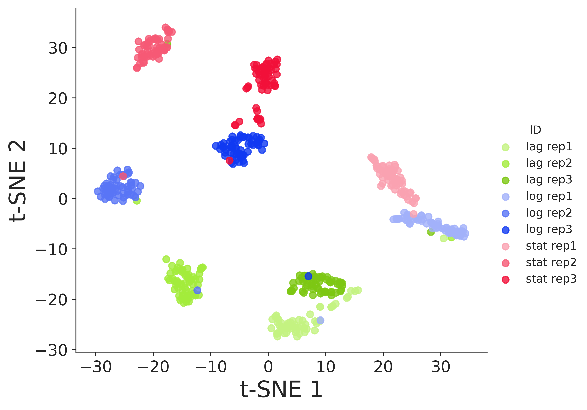
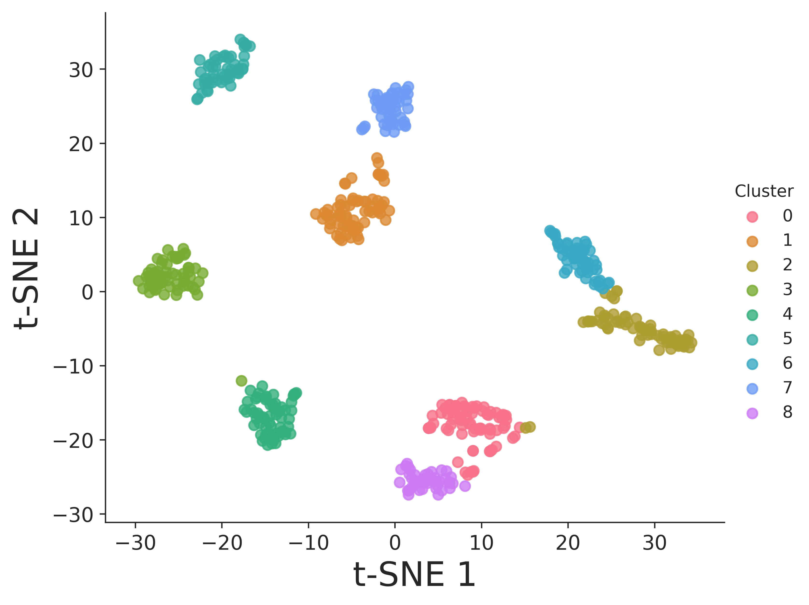

# Characterizing phenotypic heterogeneity in isogenic bacterial populations using flow cytometry and Raman spectroscopy

This repository accompanies the manscript "*Characterizing phenotypic heterogeneity in isogenic bacterial populations using flow cytometry and Raman spectroscopy*" by [C. Garcia-Timermans](https://github.com/Cristina-GT), [P. Rubbens](https://github.com/prubbens), R. Props, [F.-M. Kerckhof](https://github.com/FMKerckhof), J. Heyese, A. Skirtach,  W. Waegeman and N. Boon. 

## ABSTRACT: 
Investigating phenotypic heterogeneity can help to better understand and manage microbial communities. However, characterizing phenotypic heterogeneity remains a challenge, as there is no standardized analysis framework. Several optical tools are available, which often describe properties of the individual cell. In this work, we compare Raman spectroscopy and flow cytometry to study phenotypic heterogeneity in bacterial populations. The growth phase of E. coli populations was characterized using both technologies. Our findings show that flow cytometry detects and quantifies shifts in phenotypic heterogeneity at the population level due to its high-throughput nature. Raman spectroscopy, on the other hand, offers a much higher resolution at the single-cell level (i.e. more biochemical information is recorded). Therefore, it is capable of identifying distinct phenotypic populations when coupled with standardized data analysis. In addition, it provides information about biomolecules that are present, which can be linked to cell functionality. We propose an automated workflow to distinguish between bacterial phenotypic populations using Raman spectroscopy and validated this approach with an external dataset. We recommend to apply flow cytometry to characterize phenotypic heterogeneity at the community level, and Raman spectroscopy to perform a more in-depth analysis of heterogeneity at the single-cell level. 

## Structure: 
* Analysis performed in R can be found [here](). 
* Analysis in Python (PhenoGraph and t-SNE) can be found [here](). 
* Raw flow cytometry data can be found [here](). 
* Raw Raman spectra can be found [here](). 
* Additional validation of PhenoGraph and t-SNE using an external dataset can be found [here](). Data was originally published by [Teng et al](https://www.nature.com/articles/srep34359). 

## Example: 
Raman spectroscopy offers a high-resolution characterization of bacterial cells, which can be analyzed with automated algorithms, developed for single-cell data. Here you see an example of a visualization using t-SNE, along with an automated clustering according to the PhenoGraph algorithm:  

<p align="center">
  
  
</p>


## Acknowledgements
If you find our study useful, please consider citing: 
``` bibtex
@Article{Garcia-Timermans2019,
  Title       = {Characterizing phenotypic heterogeneity in isogenic bacterial populations using flow cytometry and Raman spectroscopy},
  Author      = {Garcia-Timermans, C. and Rubbens, P. and Props, R. and Kerckhof, F.-M. and Heyse, J. and Skirtach, A. and Boon, N. and Waegeman, W. },
  Journal     = {In preparation},
  Year        = {2019},
}
```